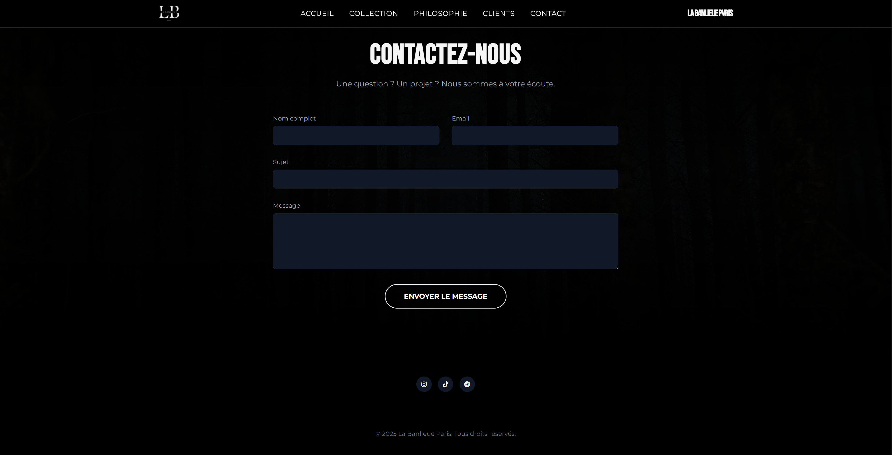
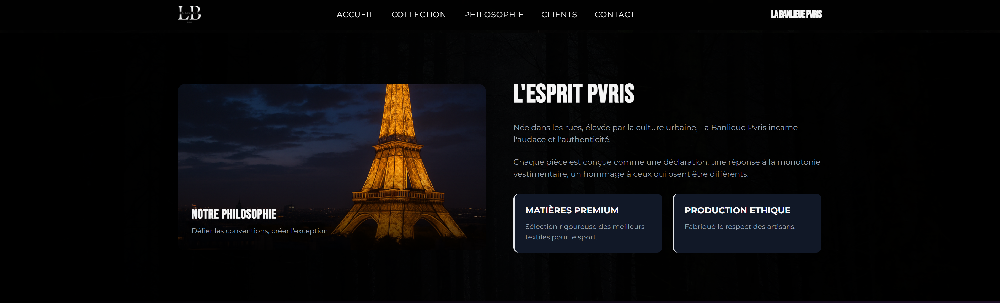
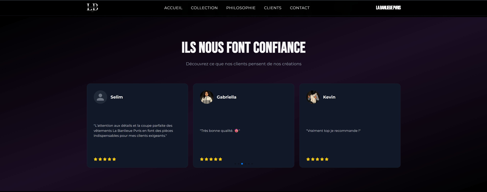

# LA BANLIEUE PVRIS — Site Officiel

> Projet Angular — Front-end complet pour la marque de mode urbaine "La Banlieue Pvris"

---

## ✨ Aperçu

Ce site web est la vitrine digitale officielle de la marque "La Banlieue Pvris", réalisé sous Angular. Il présente la collection 2025, la philosophie de la marque, les avis clients, et permet un contact direct via formulaire.



---

## 👋 Pop-up d'entrée personnalisée (Telegram)

✅ À l'arrivée sur le site, une pop-up animée s'affiche et demande à l'utilisateur s'il a déjà rejoint le canal Telegram officiel :

* **Question posée** : "As-tu déjà rejoint le canal Telegram ?"
* Si l'utilisateur répond "Oui", l'information est stockée dans le `localStorage` pour ne pas afficher de nouveau la pop-up
* Sinon, un lien d'invitation vers Telegram est proposé : [https://t.me/lbpvris](https://t.me/lbpvris)


---

## 🌐 Technologies Utilisées

* Angular
* TypeScript
* Tailwind CSS (design responsive et moderne)
* GSAP (animations)
* FormSubmit (gestion du formulaire de contact sans backend)

---

## 📧 Formulaire de contact

Le formulaire présent dans la section "Contactez-nous" permet aux utilisateurs d'envoyer un message directement à l'adresse e-mail : `lbpvris@gmail.com` via l'API FormSubmit.


* Tous les champs sont obligatoires (Nom, Email, Sujet, Message)
* Affichage d'un message de confirmation en cas de succès

---

## 🔍 Philosophie & Valeurs de la marque

La section "Philosophie" présente l'histoire et l'identité de la marque. Une mise en page moderne avec image et encarts animés rend la lecture immersive.



---

## 📅 Collection 2025

La collection est affichée sous forme de cartes produits cliquables, animées au survol. Chaque image est interactive.


---

## 👥 Avis clients authentiques

Les avis affichés dans la section "Ils nous font confiance" sont réels. Chaque témoignage peut être justifié par des vidéos disponibles sur le canal Telegram.



---

## 📖 Pied de page personnalisé

Le footer présente uniquement les réseaux sociaux officiels, centrés pour un rendu moderne et minimaliste.

* [Instagram](https://www.instagram.com/lbpvris/#)
* [TikTok](https://www.tiktok.com/@lb.pvris)
* [Telegram](https://t.me/lbpvris)

---

## 🚀 Lien de déploiement

Une fois le projet déployé, le lien du site sera ajouté ici :

> ⭐ **Lien du site en ligne :** [https://votresite.com](https://votresite.com)

---

## 📑 Organisation du code

* `app.component.ts` : Gestion des animations, de la pop-up Telegram, et des interactions modales
* `app.component.html` : Structure principale (Accueil, Philosophie, Collection, Avis, Contact)
* `styles.css` : Thème sombre avec touches d'accent colorées (rose, violet)

---

## 📦 Installation & test local

```bash
npm install
ng serve --open
```

Le site sera disponible sur `http://localhost:4200`

---

## 📊 Roadmap / Idées futures

* Ajout d'une vidéo d'accueil
* Intégration d'un back-office pour gérer les produits
* Newsletter connectée à une base de données

---

Crédit : Ce site a été conçu par passion pour le style et la culture urbaine — "La Banlieue Pvris".
